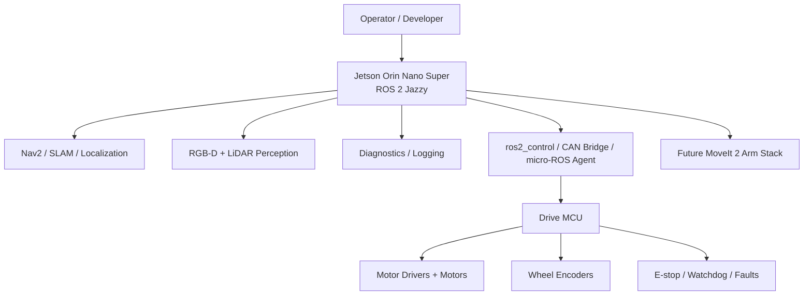

# System Architecture Diagram

```mermaid
flowchart TD
  OP[Operator / Developer] --> JETSON[Jetson Orin Nano Super
ROS 2 Jazzy]
  JETSON --> NAV[Nav2 / SLAM / Localization]
  JETSON --> PER[RGB-D + LiDAR Perception]
  JETSON --> DIAG[Diagnostics / Logging]
  JETSON --> BRIDGE[ros2_control / CAN Bridge / micro-ROS Agent]
  BRIDGE --> MCU[Drive MCU]
  MCU --> MOTORS[Motor Drivers + Motors]
  MCU --> ENC[Wheel Encoders]
  MCU --> ESTOP[E-stop / Watchdog / Faults]
  JETSON --> FUTURE_ARM[Future MoveIt 2 Arm Stack]
```
