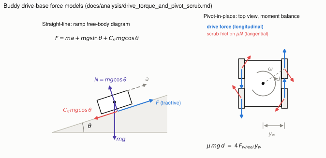

<!-- GENERATED from drive_torque_and_pivot_scrub.py by tools/build.py — edit the notebook (marimo edit docs/analysis/drive_torque_and_pivot_scrub.py) or design_params.yaml, then rebuild. -->

# Drive Torque and Pivot Scrub — Derivations

This is the methods document behind
[`motor_sizing_and_selection.md`](../research/hardware/motors_and_gearboxes/motor_sizing_and_selection.md)
and milestone [M01](../portfolio/milestones/M01-drive-motor-selection.md). Every
result is derived from first principles, substituted numerically so it can be
checked by hand, and bounded by its stated limits of validity. **Every number in
this document is computed live from `design_params.yaml` and the requirements
yaml** (this page is exported from a marimo notebook — prose, code, figures, and
the URDF share one parameter source and cannot disagree).

## 1. Notation

| Symbol | Meaning | Current value | Units |
|---|---|---|---|
| $m$ | gross robot mass (design ceiling) | 20 | kg |
| $g$ | gravitational acceleration | 9.80665 | m/s² |
| $\theta$ | ramp angle | 5 (v0.1), 0–20 swept | deg |
| $a$ | commanded forward acceleration | 0.5 | m/s² |
| $C_{rr}$ | rolling resistance coefficient | 0.05 (carpet, high end) | — |
| $r$ | wheel radius | 0.048 (goBILDA 3626-0014-0096 Hogback (96 mm, 50A)) | m |
| $n$ | driven wheels (one motor each) | 4 | — |
| $\eta$ | drivetrain efficiency | 0.75 | — |
| $S$ | safety factor (applied to demand) | 2 | — |
| $v$ | ground speed (teleop max) | 0.75 | m/s |
| $\mu$ | lateral scrub friction coefficient | 0.6–0.8 (carpet), ~0.4 (marble) | — |
| $x_w,\ y_w$ | wheel contact offsets from chassis center | 0.09, 0.13 | m |

Design values come from `design_params.yaml` (single source of truth, which
also generates `buddy_params.xacro`); requirement values from
`buddy_v0_1_requirements.yaml`. Assumptions are justified and stress-tested in
§7. (Assumption dict this run: crr=0.05, η=0.75,
S=2.)

## 2. Straight-line tractive force

Newton's second law along the ramp surface (see FBD, left panel). Three forces
oppose forward motion, so the required tractive force at the tire–ground
interface is their sum:

$$F = \underbrace{ma}_{\text{inertia}} + \underbrace{mg\sin\theta}_{\text{grade}} + \underbrace{C_{rr}\,mg\cos\theta}_{\text{rolling resistance}}$$

- **Inertia** $ma$: accelerating the full mass at the commanded rate.
- **Grade** $mg\sin\theta$: the weight component parallel to the ramp.
- **Rolling resistance** $C_{rr}mg\cos\theta$: proportional to the normal load
  $mg\cos\theta$, which is why it shrinks slightly as the ramp steepens.

Substituting the v0.1 design case ($m=20$, $a=0.5$,
$\theta=5°$, $C_{rr}=0.05$):

$$F = 20(0.5) + 20(9.80665)\sin 5° + 0.05(20)(9.80665)\cos 5°$$
$$F = 10.00 + 17.09 + 9.77 = 36.86\ \text{N}$$

## 3. From force to per-motor torque

The force is shared by $n$ driven wheels; each wheel converts force to shaft
torque through the radius $r$. Losses mean the motor must supply *more* than
the ideal torque, so efficiency divides; the safety factor multiplies the
demand (we inflate the requirement, never the motor's claimed capability):

$$T = \frac{F\,r}{n}\cdot\frac{S}{\eta}$$

$$T = \frac{36.86 \times 0.048}{4}\cdot\frac{2}{0.75} = 0.442 \times 2.667 = 1.18\ \text{N}\cdot\text{m} \text{ per motor}$$

Units check: $[\text{N}][\text{m}] = \text{N}\cdot\text{m}$; $S$ and $\eta$ are
dimensionless. ✓

## 4. Wheel speed

Rolling without slip, $v = \omega r$, converted to RPM:

$$\text{RPM} = \frac{v}{2\pi r}\times 60 = \frac{0.75}{2\pi(0.048)}\times 60 = 149.2$$

This is a *loaded* speed target — compare against a motor's speed under load,
not its no-load rating (brushed DC speed droops roughly linearly with torque).

## 5. Braking as an acceleration case

Stopping from $v$ in distance $s$ (constant deceleration, from $v^2 = 2as$):

$$a_{stop} = \frac{v^2}{2s} = \frac{0.75^2}{2(0.25)} = 1.12\ \text{m/s}^2$$

Fed back into §2–3 in place of $a$, this gives 1.58 N·m — a brief
transient, not a thermal (continuous) requirement.

## 6. Pivot-in-place scrub — the requirement that actually sized the motors

A skid-steer robot has no steering axis: to yaw, the wheels must drag sideways
across the floor. During a pivot about the chassis center, each contact patch
moves on a circle of radius

$$d = \sqrt{x_w^2 + y_w^2} = \sqrt{0.09^2 + 0.13^2} = 0.158\ \text{m}$$

Kinetic friction opposes each patch's sliding direction — i.e., acts
*tangentially*, resisting the rotation (see FBD, right panel). With weight
split evenly ($N = mg/4$ per wheel), the total resisting yaw moment about the
pivot center is:

$$M = \sum_{i=1}^{4} \mu \frac{mg}{4} d = \mu\, m g\, d = 0.6\,(20)(9.80665)(0.158) = 18.6\ \text{N}\cdot\text{m} \quad (\mu = 0.6)$$

The drive wheels generate yaw moment through their *longitudinal* forces acting
at the lateral offset $y_w$ (the fore-aft offset $x_w$ contributes no moment
from a longitudinal force). Left wheels drive one way, right wheels the other;
all four contribute:

$$M_{drive} = 4 F_{wheel}\, y_w \;\;\Rightarrow\;\; F_{wheel} = \frac{M}{4 y_w} = \frac{18.6}{4(0.13)} = 35.8\ \text{N}$$

$$T_{pivot} = \frac{F_{wheel}\, r}{\eta} = \frac{35.8 \times 0.048}{0.75} = 2.29\ \text{N}\cdot\text{m} \text{ per motor} \quad (\mu = 0.6)$$

Repeating for the $\mu$ range: **1.53 N·m** at
$\mu=0.4$ (marble), **2.29 N·m** at
$\mu=0.6$, **3.05 N·m** at
$\mu=0.8$ (thick carpet). No safety factor is applied here —
this is already a worst-case peak demand and is carried as a range; it sets the
motor's **stall** requirement, not its continuous rating. The selected motor's
stall is 3.73 N·m —
**22% margin at the
worst-case $\mu$**.

*Left: ramp FBD behind §2. Right: pivot kinematics behind §6 — friction acts
tangentially on each patch (radius $d$), drive forces act longitudinally at
lateral offset $y_w$. Regenerate: `python3 tools/figures/plot_drive_fbd.py`.*

## 7. Limits of validity — where these models stop being true

1. **Rigid-body, quasi-static, even weight split.** No load transfer under
   acceleration or on ramps; at the design accel and ramp the shift is a few
   percent of $mg$ — negligible for sizing, not for traction-limit analysis at
   higher accelerations.
2. **Point-contact Coulomb friction.** Carpet actually deforms (pile plowing),
   which behaves partly like added rolling resistance rather than pure Coulomb
   sliding — this is why $\mu$ is carried as a range to be **measured on the
   real floor before buying four motors** (single-motor drag test). The
   selected wheel (Hogback, ADR-0004) has a crowned tread that shrinks the
   contact patch during pivots specifically to reduce scrub; the model ignores
   this, which adds conservatism in the direction of safety.
3. **Pivot about the geometric center.** True for symmetric commands and mass
   distribution; a payload shifting the CG moves the pivot point and
   redistributes normal loads.
4. **Static vs kinetic friction.** Breakaway (static) torque exceeds the
   kinetic value computed here; the mitigation (driver current limiting +
   arc turns in software) is sized against the kinetic estimate at high $\mu$.
5. **No suspension compliance.** A rigid 4-wheel chassis on uneven floor can
   unload a wheel entirely; the moment balance then loses that wheel's
   contribution on both the resisting and driving side.

## 8. Verification plan (closes the loop on the estimates)

- Bench: stall-torque spot check of one purchased motor against datasheet
  before buying four.
- Floor: powered drag test to back out effective $\mu$ on the actual carpet
  and marble (log driver current at known PWM).
- Ramp: REQ_MOB-style ramp start test with current logging — measured current
  maps back through the motor's torque constant to validate §2–3 end to end.
