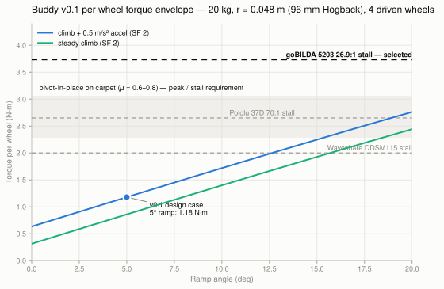

# M01 — Sizing and Selecting the Drive Motors

## The problem

Buddy is a ~20 kg indoor autonomous robot on a four-wheel skid-steer base
(0.30 m × 0.30 m footprint, 0.12 m wheels, carpet and marble floors). Nothing
downstream — motor drivers, the drive MCU, the battery, the chassis — could be
specified until the motors were, so this was the gating analysis of the whole
hardware phase.

Requirements that drive the numbers (`docs/requirements/buddy_v0_1_requirements.yaml`):
0.75 m/s teleop max, 0.5 m/s autonomous, 5° ramps, 0.25 m stopping distance,
operation near people and pets.

## The analysis

Full derivations — governing equations, symbol tables, numeric substitutions
you can check by hand, and limits of validity — are in
[`docs/analysis/drive_torque_and_pivot_scrub.md`](../../analysis/drive_torque_and_pivot_scrub.md).
The two results that matter:

**Straight-line** (Newton's second law along the ramp, free-body diagram in the
analysis doc):

$$F = ma + mg\sin\theta + C_{rr}mg\cos\theta,\qquad T = \frac{F\,r}{n}\cdot\frac{S}{\eta}$$

which gives **1.47 N·m per wheel** for the worst driving case (5° ramp +
0.5 m/s² acceleration, SF 2.0) at **119 wheel RPM** for 0.75 m/s.

**Pivot-in-place** — the insight that actually sized the motors. A skid-steer
robot turning in place drags its tires sideways; balancing the resisting yaw
moment from tire scrub against the moment the drive wheels can generate:

$$\mu\,mg\,d = 4\,F_{wheel}\,y_w \;\Rightarrow\; T_{pivot} = \frac{F_{wheel}\,r}{\eta}$$

with contact radius $d = \sqrt{x_w^2+y_w^2} = 0.158$ m. On carpet
(μ ≈ 0.6–0.8) that is **2.9–3.8 N·m per wheel — roughly 2× the worst driving
case**. Pivot turns, not driving, set the stall requirement.

*The two force models: ramp FBD (left) and the pivot moment balance (right) —
friction acts tangentially at radius $d$, drive forces act longitudinally at
lateral offset $y_w$.*

*The envelope in one figure (shown at the final 96 mm wheel per the update
below): the computed load curves stay below 2.8 N·m even at 20°, but the
pivot-scrub band (shaded) sits at 2.29–3.06 N·m. Of the three candidate stall
lines, only the selected motor clears the band.*
(Regenerate: `python3 tools/figures/plot_torque_envelope.py` — the script
imports the same functions the analysis uses, so figure and analysis cannot
disagree.)

## Assumptions, and what happens if they're wrong

| Assumption | Value | Justification | Sensitivity |
|---|---|---|---|
| Rolling resistance Crr | 0.05 | high end of published carpet range | halving it changes cruise torque 0.2 → 0.08 N·m — irrelevant to sizing |
| Scrub friction μ | 0.6–0.8 | lateral rubber-on-carpet estimates; carried as a *range*, not a point | at μ = 0.8 the requirement is 3.8 N·m vs 3.73 N·m stall — pivots may current-limit on thick carpet; mitigation is arc turns (software), not bigger motors |
| Drivetrain efficiency η | 0.75 | conservative for single-stage planetary + hub coupling | at η = 0.85, all requirements drop ~12% |
| Safety factor | 2.0 on driving loads | covers mass growth to the 20 kg limit and model error | none on pivot numbers — those are already worst-case peak demands |
| Gross mass | 20 kg | design ceiling, not current build mass | requirements scale linearly with mass — the single biggest lever if budget forces a descope |

## Alternatives considered

| Option | Why not |
|---|---|
| Pololu 37D 70:1 ($244/4) | 2.65 N·m stall is *inside* the pivot band; well-documented but slower and pricier than the selection |
| JGB37-520 (~$70/4) | inconsistent vendor specs, QC risk; would stall in carpet pivots at 20 kg. Kept as the documented fallback if gross mass drops to ~10 kg |
| Waveshare DDSM115 hub servos (~$240/4) | tempting — integrated driver + encoder over one RS485 bus would delete most of the drive electronics — but 2.0 N·m stall is far below the band. A lesson in not letting elegance override the load case |

## The decision

**4× goBILDA 5203 Yellow Jacket 26.9:1** (223 RPM, 3.73 N·m stall, 751.8 PPR
encoder, $54.99 each) — [ADR-0003](../../decisions/ADR-0003-drive-motor-selection.md).
The only candidate clearing the pivot band, with a swappable gear cartridge
(13.7:1 → 435 RPM) as the future speed path without re-engineering mounts.

Accepted costs: $220 of a $300–600 budget (the tightest design conflict on the
project), a 9.2 A/motor stall draw that makes driver current-limiting mandatory,
and commitment to the goBILDA 8 mm REX shaft / 32 mm-pitch mounting ecosystem.

## What would change this decision

- Measured carpet μ above ~0.8 (test with a purchased motor before buying four).
- Budget forcing total sensor+power spend under ~$250 → descope mass to ~10 kg
  and rerun the envelope with JGB37-520-class motors.
- v0.1 dropping carpet operation entirely → the DDSM115's electronics
  simplification becomes the better trade on hard floors (μ ≈ 0.4 → 1.9 N·m).

## Update — 2026-07-11, wheel selection (ADR-0004)

The 0.06 m wheel radius above was the URDF placeholder in force when the motor
decision was made. Wheels were sourced the same day: **96 mm goBILDA Hogback**
traction wheels, whose crowned tread is purpose-designed to reduce skid-steer
scrub. At r = 0.048 m every requirement relaxes — design case 1.47 → 1.18 N·m,
pivot band 2.9–3.8 → 2.29–3.06 N·m — so the motor selected against the harsher
placeholder now clears the worst-case pivot (μ = 0.8) with 22% stall margin
instead of being marginal. The trade: ground clearance was formally amended
0.05 → 0.038 m (still ~2× typical indoor thresholds). The envelope figure above
reflects the final 96 mm wheels; details in
[ADR-0004](../../decisions/ADR-0004-wheel-selection-and-clearance-amendment.md).

## Artifacts

- Analysis: [`motor_sizing_and_selection.md`](../../research/hardware/motors_and_gearboxes/motor_sizing_and_selection.md)
- Decision record: [`ADR-0003`](../../decisions/ADR-0003-drive-motor-selection.md)
- Figure source: [`tools/figures/plot_torque_envelope.py`](../../../tools/figures/plot_torque_envelope.py)
- Sizing tool: [`robot_ws/tools/torque_sweep.py`](../../../robot_ws/tools/torque_sweep.py) · sweep data: `robot_ws/analysis/torque_sweep.csv`
