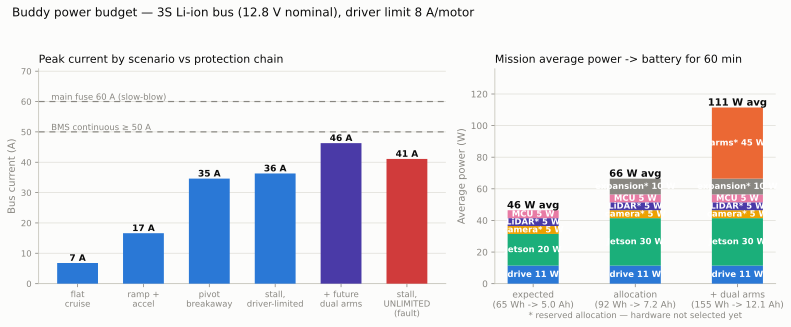

# M02 — Power Architecture: Turning a Fault Current into a Design Parameter

## The problem

Four drive motors, each with a 9.2 A stall rating, plus a Jetson Orin Nano, an
RGB-D camera, a 2D LiDAR, and a drive MCU. The naive worst case — 36.8 A of
motor stall alone — read like a battery that would be either impossible or
unaffordable, and it nearly stalled the project ("I fear we are looking at
impossible worst-case amperage").

## The reframe that dissolved it

**Stall current is what flows after control has already failed — you never size
a battery for it, you cap it.** The motor drivers' current limit converts the
worst case from a physical accident into a chosen number: with 8 A per motor
(set in firmware from the VNH5019's 140 mV/A current sense), the designed peak
is 37 A *by construction*, regardless of what software does.

The build validator caught the first attempt at this: a 7 A limit permits only
2.81 N·m of torque — below the 3.05 N·m worst-case carpet pivot from
[M01](M01-drive-motor-selection.md). The limit went to 8 A (permits 3.23 N·m),
and the check now runs on every build: derivations in
[`power_budget_and_battery.md`](../../analysis/power_budget_and_battery.md).

*Left: every designed scenario sits under the BMS line; the unlimited-stall
fault bar lands between BMS and fuse — the protection chain visibly working as
ordered layers. Right: the three mission models that size the battery.*

## Sizing for a robot that doesn't exist yet

Mid-design, the roadmap changed: a future version adds **two 6-DOF arms** on
the same battery. Rather than buy an 8 Ah pack destined for a drawer, the
amendment (ADR-0005, 2026-07-14) provisions the arms as an explicit,
documented placeholder — 12 XM430-class joints, +45 W average, +10 A peak —
and sizes the purchase against that future:

| Mission model | Average power | Energy for 60 min | Capacity @ 11.1 V |
|---|---|---|---|
| v0.1 expected | 46 W | 65 Wh | 5.8 Ah |
| v0.1 allocation (guarantee) | 66 W | 92 Wh | 8.3 Ah |
| **Future + dual arms** | **111 W** | **155 Wh** | **13.9 Ah** |

**Result: 3S Li-ion ≥ 14 Ah, BMS ≥ 50 A, ~$100–140.** Peak demand is a mild
3.4C — runtime, not the feared peaks, drives the sizing. In v0.1 the same pack
simply runs ~90 minutes. The unchosen camera and LiDAR carry ≤ 5 W *reserved
allocations* that became hard selection constraints — and held, unamended,
when sensors were actually selected (0.9 W and 4.5 W).

## Assumptions, and what happens if they're wrong

| Assumption | Value | Sensitivity |
|---|---|---|
| Motor no-load current | 0.25 A (estimate) | shifts the torque-at-limit margin; measured at bench before it matters |
| Duty model (70% moving, 1.5× maneuver) | assumed | replaced by logged power data from first teleop |
| Arm provision | 12 joints, 45 W / 10 A placeholder | order-of-magnitude by design; `power.future_arms` in `design_params.yaml` is replaced with real servo specs at arm selection and everything regenerates |
| Li-ion usable fraction | 0.80 | covers early life, not end-of-life fade |

## What would change this decision

- A measured BMS trip below spec on the bench → different pack vendor.
- Arm selection exceeding the 10 A peak placeholder → re-run; protection chain
  scales (validator enforces).
- Sustained real-world average above ~110 W → capacity or duty-cycle revisit.

## Artifacts

- Decision record: [`ADR-0005`](../../decisions/ADR-0005-power-architecture-3s-liion.md) (with the dual-arm amendment)
- Derivation: [`power_budget_and_battery.md`](../../analysis/power_budget_and_battery.md) — every number computed from `design_params.yaml`
- Figure source: [`tools/figures/plot_power_budget.py`](../../../tools/figures/plot_power_budget.py)
- Downstream: driver requirement (adjustable 8 A limit) → VNH5019 selection; interface verification in [`electrical_interfaces.md`](../../system_model/electrical_interfaces.md)
