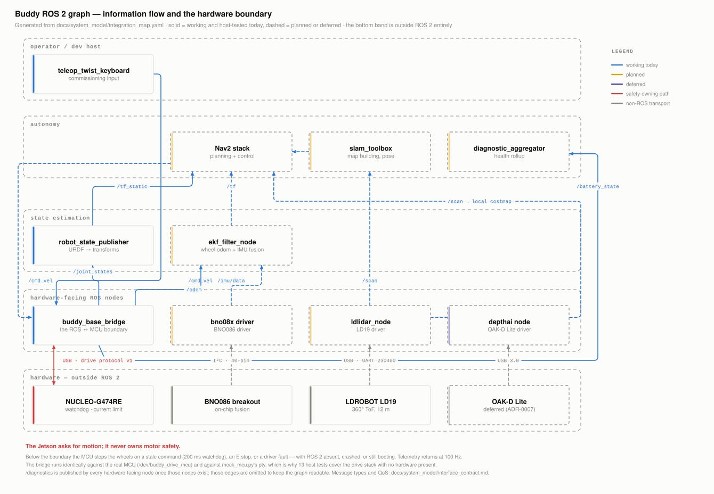
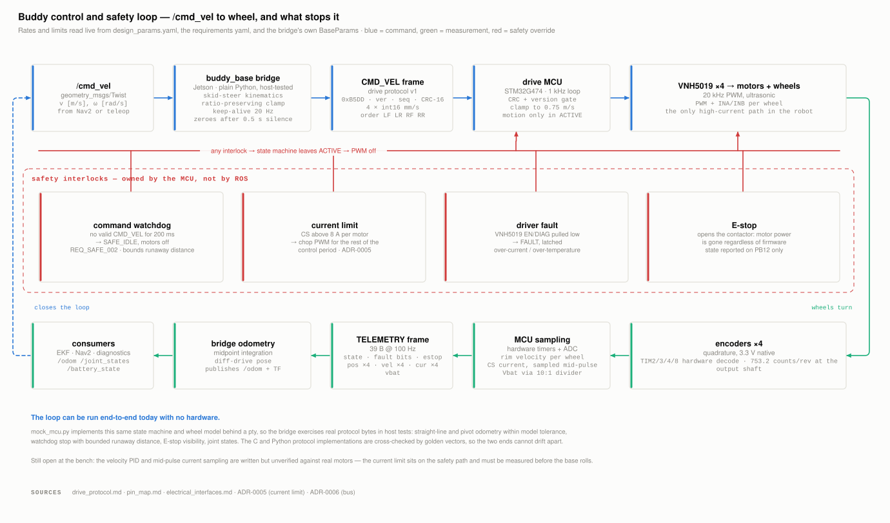
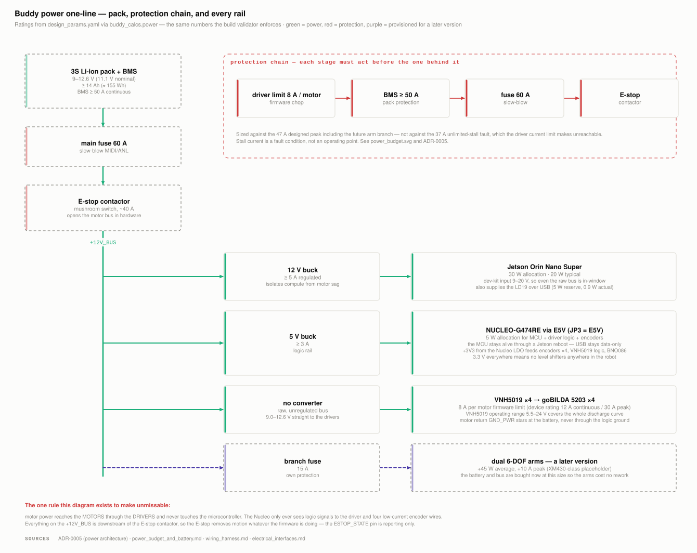
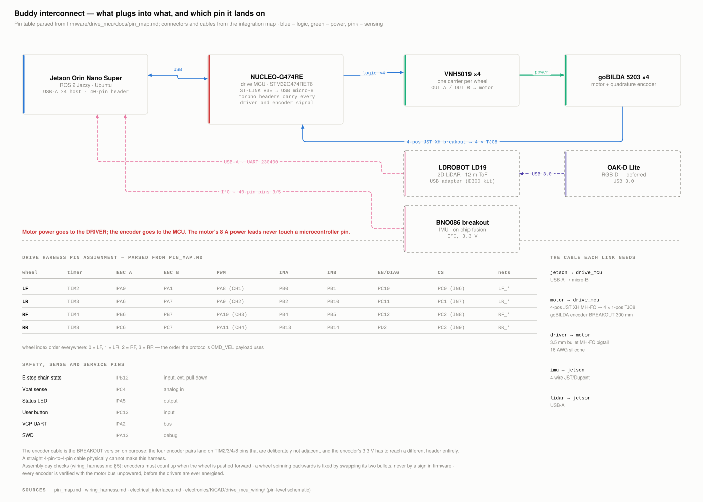
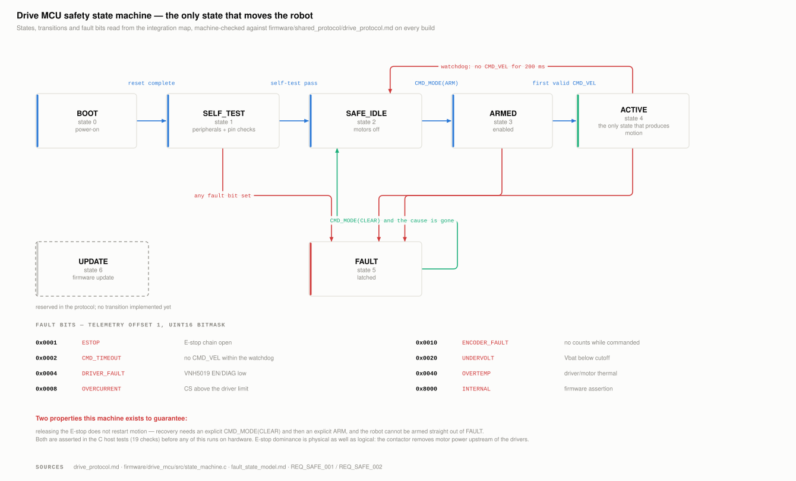
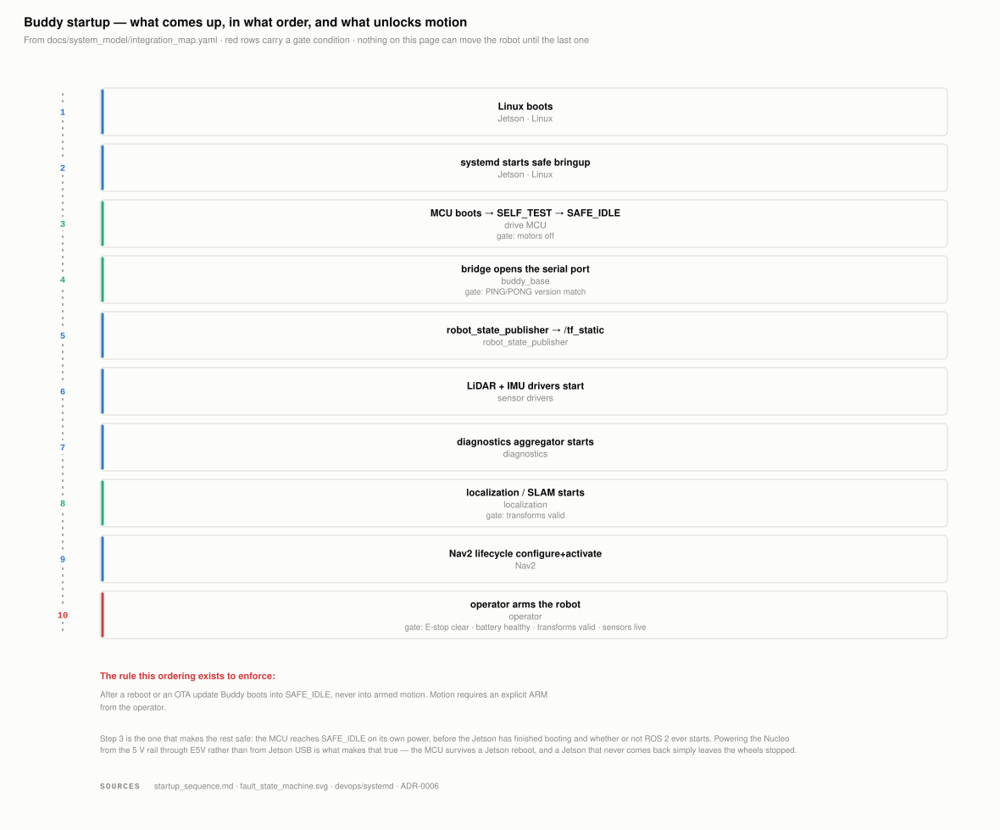

# System Integration — Start Here

**Date:** 2026-07-28 · **Status:** the six integration figures are generated and
machine-checked; the hardware they describe is decided (ADR-0003 … ADR-0007) but
not yet purchased or bench-verified.

Buddy's integration decisions were correct but scattered: the ROS contract in one
file, the pin map in the firmware tree, the connectors in a harness document, the
protection chain inside a power analysis, the state machine in three places at
once. Each document was right; no document showed how they fit together, and the
one drawing that tried (`assets/diagrams/system_architecture_mermaid.md`) had
gone stale enough to contradict [ADR-0006](../decisions/ADR-0006-mcu-jetson-bus-usb-serial.md) —
it still showed a CAN bridge. It has been deleted.

**This page is the index to the integration picture.** Every figure below is
generated from the repo by a script in `tools/figures/`, regenerated by
`python3 tools/build.py`, and checked against the files that own the underlying
facts. None of them can be edited by hand, and none of them can silently drift.

---

## The six figures

### 1. ROS 2 graph — `assets/figures/ros_graph.svg`

Nodes, topics, and the point where the system stops being ROS. Solid boxes run
and are host-tested today; dashed ones are planned or deferred, so the figure
doubles as a build-progress chart. The bottom band is deliberately outside ROS:
the Jetson asks for motion and never owns motor safety.

*Owns nothing.* Message types and QoS live in
[`interface_contract.md`](interface_contract.md); node status comes from the
integration map, and the bridge's topics are checked against
`ros_bridge_node.py` itself.

### 2. Control and safety loop — `assets/figures/control_safety_loop.svg`

What happens between Nav2 asking for motion and a wheel turning, the measurement
path that closes the loop, and the four interlocks that override both. Rates and
limits are read live from `design_params.yaml`, the requirements yaml, and the
bridge's own `BaseParams` — the keep-alive rate in the picture is the keep-alive
rate in the code.

*The claim to check:* any interlock takes the MCU out of `ACTIVE`, and only
`ACTIVE` produces motion.

### 3. Power one-line — `assets/figures/power_one_line.svg`

Pack, protection chain, and every rail with what it feeds.
[`power_budget.svg`](../analysis/power_budget_and_battery.md) answers *how many
amps*; this answers *what is in series with what*. Ratings come through
`buddy_calcs.power`, so the drawing cannot show a fuse the build validator would
reject.

*The rule it exists to make unmissable:* motor power reaches the motors through
the drivers and never touches the microcontroller.

### 4. Interconnect and pin map — `assets/figures/interconnect.svg`

The assembly-day picture: every cable, its connector gender, and the pin each
wire lands on. The pin table is **parsed** from
[`pin_map.md`](../../firmware/drive_mcu/docs/pin_map.md) rather than retyped;
connector and cable details come from the integration map's link records, which
are the same records the shopping list was built from.

### 5. Fault state machine — `assets/figures/fault_state_machine.svg`

The MCU's seven states, every transition, and all eight fault bits. States and
bits are asserted against
[`drive_protocol.md`](../../firmware/shared_protocol/drive_protocol.md) on every
build, so the drawing cannot disagree with the wire format that the firmware and
the bridge both implement.

### 6. Startup sequence — `assets/figures/startup_sequence.svg`

Boot to motion, and the gate on each step. The last row is the point of the
figure: motion is unlocked only by an explicit operator action with four
conditions already true.

---

## The schematics

The figures above are readable; the schematics are authoritative. Both are
generated and both have their connectivity asserted pin-by-pin against an
independently written expectation.

| Sheet | Covers | Generator | Verifier | Rendered |
|---|---|---|---|---|
| `electronics/KiCAD/drive_mcu_wiring/` | NUCLEO ↔ 4× VNH5019 ↔ 4× motor/encoder, Vbat divider | `tools/kicad/gen_drive_wiring.py` | `tools/kicad/check_drive_wiring.py` (43 nets) | [`drive_mcu_wiring.pdf`](../../electronics/KiCAD/drive_mcu_wiring/drive_mcu_wiring.pdf) |
| `electronics/KiCAD/system_wiring/` | pack, protection chain, rails, Jetson ↔ MCU ↔ sensors, future arm branch | `tools/kicad/gen_system_wiring.py` | `tools/kicad/check_system_wiring.py` (16 nets) | [`system_wiring.pdf`](../../electronics/KiCAD/system_wiring/system_wiring.pdf) |

The two sheets meet at shared net names — `+12V_BUS`, `GND_PWR`, `+5V_RAIL`,
`+3V3`, `GND`, `ESTOP_STATE` — so a rail can be followed across both. PDF rather
than SVG because KiCAD's SVG export draws every glyph as a path (~1 MB/sheet vs
~70 kB), and a PDF is what you actually print for the bench.

---

## How this cannot go stale

`docs/system_model/integration_map.yaml` holds the **topology** — what connects
to what — and nothing else. The strict split:

| File | Owns |
|---|---|
| `design_params.yaml` | values we chose or assumed (8 A limit, 200 ms watchdog) |
| `docs/requirements/buddy_v0_1_requirements.yaml` | what must be true (60 min runtime) |
| `docs/system_model/integration_map.yaml` | what connects to what (topics, buses, rails, nets) |

No number that lives in the first two may be copied into the third. Where a
diagram needs one, the map writes a reference — `param:power.protection.main_fuse_a` —
which `buddy_calcs.integration.resolve()` turns into the live value at draw time.
There is no copy to go stale.

`tools/check_integration_map.py` runs as the first step of `tools/build.py` and
fails the build on any of:

| Check | Asserts |
|---|---|
| **A** structure | ids unique, every cross-reference lands, every `param:`/`req:` reference resolves |
| **B** pin map ↔ firmware | `pin_map.md` agrees with `include/pins.h`, pin by pin |
| **C** pin map ↔ schematic | the KiCAD generator's net table puts every signal on the pin the map assigns |
| **D** protocol ↔ map | states and fault bits match `drive_protocol.md` exactly |
| **E** bridge ↔ map | the topics `ros_bridge_node.py` really creates are the topics the graph draws |
| **F** ADR references | every ADR a block or link cites exists |

Each figure additionally **audits its own layout** before it is written: every
box, label and edge tag is bounds-checked against the canvas and against each
other, so a longer label from a parameter change fails the build instead of
quietly overlapping something. (Verified independently with real browser font
metrics: 417 text elements across the six figures, zero collisions.)

---

## Where the underlying facts live

The figures cite; they never restate. When something changes, change it here:

| Topic | Owning document |
|---|---|
| ROS message types, QoS, topic names | [`interface_contract.md`](interface_contract.md) |
| Which MCU pin does what | [`pin_map.md`](../../firmware/drive_mcu/docs/pin_map.md) + `include/pins.h` |
| Wire format, frame types, fault bits | [`drive_protocol.md`](../../firmware/shared_protocol/drive_protocol.md) |
| Does it interface? (levels, ranges, margins) | [`electrical_interfaces.md`](electrical_interfaces.md) |
| Which cable do I buy? | [`wiring_harness.md`](wiring_harness.md) |
| How many amps, how many watt-hours | [`power_budget_and_battery.md`](../analysis/power_budget_and_battery.md) |
| Why the architecture is this shape | [`docs/decisions/`](../decisions/) — ADR-0003 … ADR-0007 |
| Layer responsibilities | [`architecture_overview.md`](architecture_overview.md) |

## Open items these figures make visible

1. **The current limit is drawn but not measured.** The 8 A firmware chop sits on
   the safety path; `electrical_interfaces.md` lists it as bench-verify item 5.
   Until that test runs, the interlock in figure 2 is a design intent.
2. **Velocity PID and mid-pulse current sampling** are written and compile, but
   have never seen a motor.
3. **Sensor extrinsics are placeholders.** `base_laser`, `imu_link` and
   `front_camera_link` get real numbers at mounting; the ROS graph shows the
   topics, not the transforms' correctness.
4. **Nothing on these pages has been powered on.** Every hardware block is
   `proposed` — decided in an ADR, not yet purchased.
